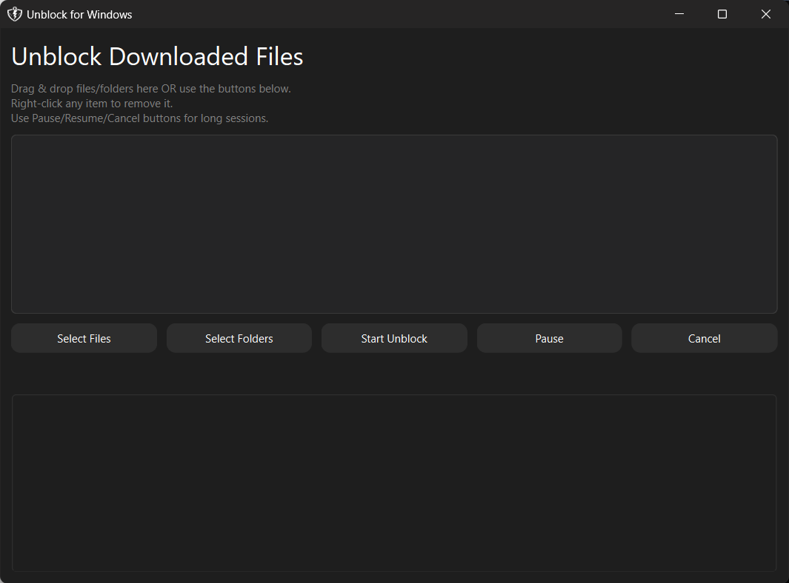
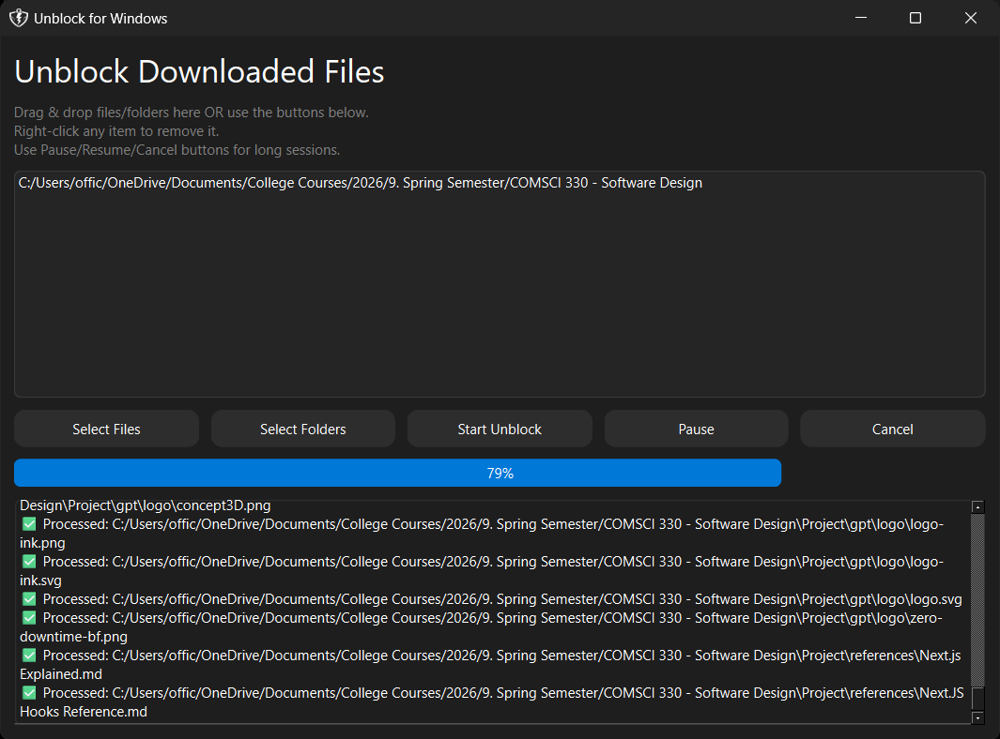
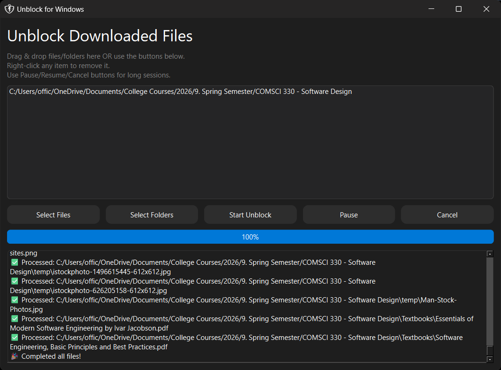

**Unblock for Windows** is a modern, lightweight utility for Windows that allows users to unblock downloaded files and folders with ease. Designed for productivity and convenience, it supports multi-file/folder selection, drag & drop, and provides pause, resume, and cancel options for long operations.

**Use Case:**

Perfect for developers, IT professionals, and power users who frequently download files from the internet and want to quickly remove the "blocked" security warning that Windows applies to downloaded files.

## Sick of this? You've found the solution!


------

## Features

- **Multi-file & multi-folder selection**
- **Drag & Drop support**
- **Pause / Resume / Cancel** ongoing operations
- **Progress bar and detailed status log**
- **Right-click to remove items from selection**
- **System tray integration**
  - Minimize to tray
  - Click tray icon to restore window
  - Tray menu with Show/Exit
- **Modern, theme-aware UI**
  - Detects Windows dark/light mode
  - Windows 11 Mica blur for enhanced aesthetics
- **Distributable as a standalone Python application**

------

## Screenshots







------

## Requirements

- Windows 10 or 11
- Python 3.10+
- [PyQt6](https://pypi.org/project/PyQt6/)
- Windows PowerShell (built-in)

------

## Installation

### 1. Clone the repository:

```
git clone https://github.com/yourusername/unblock-windows.git
cd unblock-windows
```

### 2. Create a virtual environment (recommended):

```
python -m venv venv
venv\Scripts\activate
```

### 3. Install dependencies:

```
pip install -r requirements.txt
```

**`requirements.txt` should contain:**

```
PyQt6>=6.9.1
```

### 4. Run the app:

```
python unblock_app.py
```

*(Replace `unblock_app.py` with your main script name.)*

------

## Usage

1. **Select files or folders** using the buttons, or drag & drop them into the window.
2. **Right-click any item** to remove it from the selection.
3. Click **Start Unblock** to begin unblocking.
4. Use **Pause / Resume** for long operations, or **Cancel** to stop.
5. The **progress bar** and **log panel** show real-time updates.
6. Minimize the app — it will move to the **system tray**. Click the tray icon to restore.

------

## Folder Structure

```
unblock-windows/
│
├─ resources/
│   ├─ favicon.ico
│   └─ app.ico
│
├─ unblock_app.py
├─ requirements.txt
└─ README.md
```

------

## Contributing

Contributions are welcome! Please submit a pull request or open an issue for feature requests, bug reports, or improvements.

------

## License

This project is licensed under the **MIT License**.

------

## Support / Contact

For questions or support, contact: **youremail@example.com**
